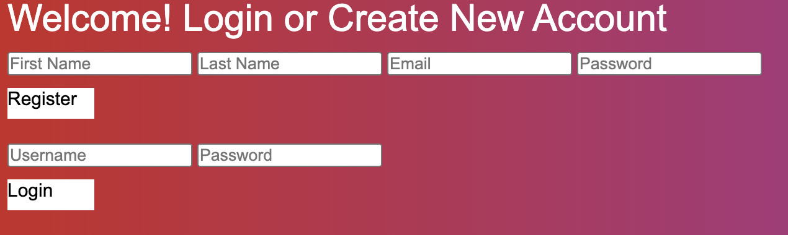

# Python & Javascrpt Auhthenication

This project was inspired by super smash brothers and I implemented a user creation and log in option 
with authentication and authorization. The bcrypt library was used along with cookies using python 
as the server language and mysql for the database.




## Resource

**Fighter**

Attributes:

* name (string)
* color (string)
* style (string)
* stock (integer)
* hp (integer)

**User**

Attributes:

* first_name (string)
* last_name (string)
* email (string)
* password (string)


## Schema

```sql
CREATE TABLE fighters (
id INTEGER PRIMARY KEY,
name TEXT,
color TEXT,
style TEXT,
stock INTEGER,
hp INTEGER);
CREATE TABLE users (
id INTEGER PRIMARY KEY,
first_name TEXT,
last_name TEXT,
email TEXT,
password TEXT);
```

## REST Endpoints

Name                           | Method | Path
-------------------------------|--------|------------------
Retrieve fighter collection    | GET    | /fighters
Retrieve fighter member        | GET    | /fighters/*\<id\>*
Create fighter member          | POST   | /fighters
Update fighter member          | PUT    | /fighters/*\<id\>*
Delete fighter member          | DELETE | /fighters/*\<id\>*
Create User                    | POST   | /users 
Login User                     | POST   | /sessions
